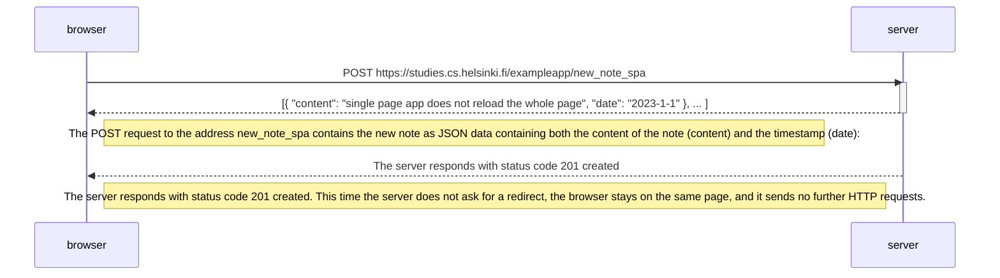

```mermaid
sequenceDiagram


    participant browser
    participant server

    browser->>server: POST https://studies.cs.helsinki.fi/exampleapp/new_note_spa
    activate server
    server-->>browser: [{ "content": "single page app does not reload the whole page", "date": "2023-1-1" }, ... ]
    deactivate server

    Note right of browser: The POST request to the address new_note_spa contains the new note as JSON data containing both the content of the note (content) and the timestamp (date):


    server-->>browser: The server responds with status code 201 created


    Note right of browser: The server responds with status code 201 created. This time the server does not ask for a redirect, the browser stays on the same page, and it sends no further HTTP requests.


```
